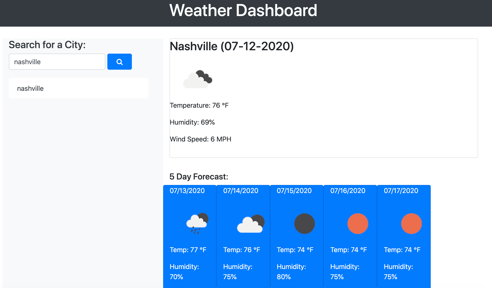
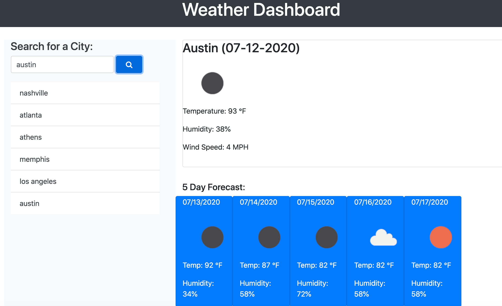
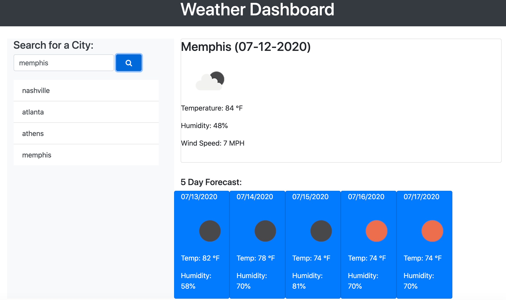

# Weather Dashboard

## Purpose
To check the weather in cities to include temperature, humidity, wind speed, uv index, and a icon displaying current weather.  Also displays weather forecast for the next 5 days.  Search history to include past searched cities.

## Built With
* HTML
* CSS
* JavaScript
* Bootstrap
* API

## Website
https://jonprine.github.io/weather-dashboard/

## Contribution
Made by Jon Prine

## Screenshots of Finished Page

